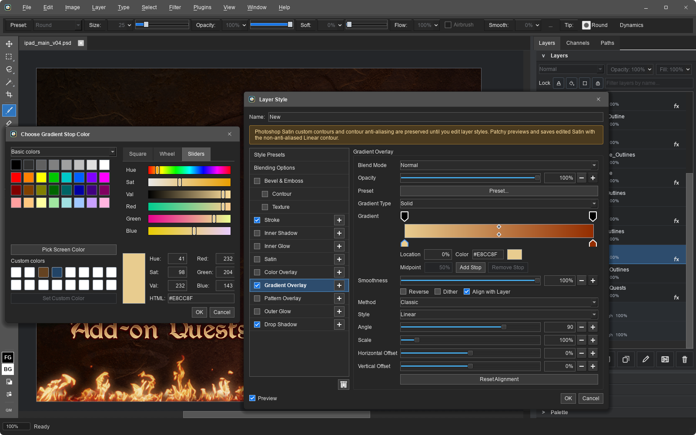
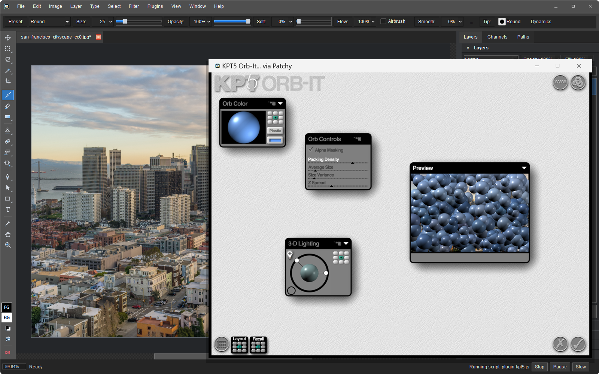

# Patchy Image Editor

A free, open-source image editor for Windows, macOS, Linux, and the browser.
Built with a focus on accurate PSD compatibility, keeping text, vectors, masks,
layer styles, and Smart Objects editable when working with layered Photoshop files.

**[Download](#download)** · **[Try in your browser](https://www.patchyimageeditor.com)** · **[Features](#features)** · **[Full gallery](docs/screenshots.md)**

For bug reports and feature requests, please [open an issue](https://github.com/SethRobinson/Patchy/issues/new) or post in [Discussions](https://github.com/SethRobinson/Patchy/discussions). These are the best places to post because search engines can index them, helping others find the questions and answers.  Want to chat? Join [Seth's Discord](https://discord.gg/QwV5VaZ).

<a href="docs/images/screenshots/smart_filters.png"></a>

*Designed to feel familiar if you're used to Photoshop's workflows and keyboard shortcuts.*

## Download

**Latest release: 1.06** · October 6, 2026 · [Release notes](#whats-new) · [All releases](https://github.com/SethRobinson/Patchy/releases)

Windows releases are code signed by Seth A. Robinson; the macOS app is signed and
notarized (Robinson Technologies Corporation); the Linux Flatpak repository is GPG
signed. Every release is published on the
[GitHub Releases page](https://github.com/SethRobinson/Patchy/releases) with SHA-256
checksums.

| Platform                  | Package                        | Download                                                                                                                             |
| ------------------------- | ------------------------------ | ------------------------------------------------------------------------------------------------------------------------------------ |
| Windows 10/11 (64-bit)    | Installer                      | [PatchyWindowsInstaller.exe](https://github.com/SethRobinson/Patchy/releases/latest/download/PatchyWindowsInstaller.exe) (65 MB)     |
| Windows 10/11 (64-bit)    | ZIP file (no installer)    | [PatchyWindowsNoInstaller.zip](https://github.com/SethRobinson/Patchy/releases/latest/download/PatchyWindowsNoInstaller.zip) (65 MB) |
| macOS 12+ (Apple Silicon) | DMG - drag to Applications     | [PatchyMacOS.dmg](https://github.com/SethRobinson/Patchy/releases/latest/download/PatchyMacOS.dmg) (70 MB)                           |
| Linux (x86_64)            | Flatpak, from our repository   | The [command below](#linux), or [com.rtsoft.patchy.flatpakref](https://rtsoft.com/flatpak/com.rtsoft.patchy.flatpakref)            |
| Linux (x86_64)            | Flatpak bundle (single file)   | [PatchyLinux.flatpak](https://github.com/SethRobinson/Patchy/releases/latest/download/PatchyLinux.flatpak) (35 MB)                   |
| Any modern browser        | Nothing to install             | [patchyimageeditor.com](https://www.patchyimageeditor.com) or [rtsoft.com/patchy](https://www.rtsoft.com/patchy/)                    |

### Linux

Paste this into a terminal. It installs Patchy for your user from the Patchy Flatpak
repository and pulls the shared KDE runtime from Flathub. No root needed.

```sh
flatpak install --user -y https://rtsoft.com/flatpak/com.rtsoft.patchy.flatpakref
```

Patchy then updates with `flatpak update` or through your software center, and starts
from your application menu or with `flatpak run com.rtsoft.patchy`.

This needs the `flatpak` tool. If needed, install it first with
`sudo apt install flatpak`.

The `.flatpakref` link in the table downloads a small file that a Flatpak-aware
software center (GNOME Software, KDE Discover) can open to install Patchy. Ubuntu has
none by default, and on Ubuntu 24.04 GNOME Software's Open button fails to start
Flatpak apps, so use the terminal command above instead.

The single-file bundle is the same build, for when you would rather download a file
first. Install it with `flatpak install --user -y PatchyLinux.flatpak`. It still fetches
the KDE runtime from Flathub, and it updates from the same repository afterwards.

My flatpak knowledge is limited, so I hope all this makes sense.  I hope to submit Patchy to Flathub eventually, but for now we have our own repository.

## Screenshots

See it in action.  Click an image for the full-size capture.

<table>
  <tr>
    <td valign="top" width="50%"><a href="docs/images/screenshots/layer_styles.png"></a><br><strong>Build up layer effects</strong><br>Layer styles with multiple effects, blending controls, and Photoshop-compatible presets.</td>
    <td valign="top" width="50%"><a href="docs/images/screenshots/plugin_kpt5.png"></a><br><strong>Bring your old plug-ins</strong><br>Kai's Power Tools 5 running in its own window over Patchy. Classic 32-bit and 64-bit 8BF filters work on Windows.</td>
  </tr>
  <tr>
    <td valign="top" width="50%"><a href="docs/images/screenshots/smart_objects.png"></a><br><strong>Keep the original editable</strong><br>Warp a Smart Object while its embedded source stays available in another tab.</td>
    <td valign="top" width="50%"><a href="docs/images/screenshots/vector_tools.png"></a><br><strong>Edit the paths</strong><br>Editable paths, gradient and pattern paint, dashed strokes, rounded corners, and a Paths panel.</td>
  </tr>
  <tr>
    <td valign="top" width="50%"><a href="docs/images/screenshots/warp_text.png"></a><br><strong>Give type its own voice</strong><br>Warped text, mixed fonts and styles in one paragraph, letter spacing, and vertical Japanese.</td>
    <td valign="top" width="50%"><a href="docs/images/screenshots/tilt_shift.png"></a><br><strong>Shape the focus</strong><br>Comes with many filters and a filter gallery, like Tilt-Shift Blur with live previews.</td>
  </tr>
</table>

[See the full gallery](docs/screenshots.md) for painting, palette mode, seamless textures, Camera Raw, long shadows, scripting, and more.

## Features

| Workflow | What you get |
| --- | --- |
| **Layered Photoshop files** | PSD and PSB, editable text, groups, masks, clipping, blend modes, and layer styles. |
| **Non-destructive editing** | Adjustment layers, embedded and linked Smart Objects, editable Smart Filters, and shared filter masks. |
| **Paint and retouch** | Pressure-aware brushes, Mixer Brush, stroke smoothing, healing, cloning, Patch, Remove Object, selections, and Liquify. |
| **Text and vectors** | Rich and vertical text, paragraph controls, Warp Text, Pen paths, shape layers, vector masks, SVG, and image tracing. |
| **PDF documents** | Import pages as editable text, vectors, and images on desktop; export single or multi-page PDFs with editable or flattened content. |
| **Photos and other formats** | Camera Raw development, HEIC/HEIF photos, layered Affinity import, and common image formats. |
| **Pixel art and game assets** | Named palettes, indexed export, seamless tiling, sprite sheets, image sequences, and animated GIF and WebP. |
| **Extend your workflow** | Legacy Photoshop filters on Windows, JavaScript scripts, batch processing, command-line tools, and local MCP control. |

[Full feature list and format support](docs/features.md) · [Scripting guide](scripts/bundled/scripting-guide.md) · [AI control setup](docs/ai-control.md)

**Local by design.** No telemetry, tracking, or uploads of your images. The browser build
runs the same editor locally through WebAssembly. Desktop builds have more memory
available and add printing, scanner/camera import, and command-line automation.
Optional update checks contact GitHub. Twelve interface languages, dark and light
schemes, and importable themes are included.

## PSD compatibility, measured

In the [October 6, 2026 Testy v2 run](https://www.rtsoft.com/testy/2026-10-06/),
Patchy opened **all 309 files** of the psd-tools test collection, and Photoshop
reopened **every Patchy save** with **all 43 text objects, 183 adjustment layers,
172 Smart Objects, and 181 live effects** kept. Patchy's perceptual render match
was **89.8%**, the highest of the seven programs tested against Photoshop's
reference, using commit `57ba855c`.

Testy v2 scores each program on what it draws itself: the baked pixels Photoshop
stores for text, shapes, fills, and Smart Objects are removed first. That is
stricter than the August run, so the two sets of numbers are not comparable.

These are dated, corpus-specific results. The linked report has every file's
renders and difference maps for all eight columns. Read the
[full comparison and methodology](docs/psd-compatibility-benchmark.md) for the
tables, per-folder results, scoring rules, and limitations.

**Know the limits:** editing is RGB/RGBA 8-bit; there is no GPU acceleration or
CMYK/Lab/16-bit/32-bit editing. Unsupported Smart Filters can remain preview-locked,
and Affinity import has format-specific limitations. See [current compatibility](docs/features.md#current-status).

## What's New

### 1.06 - October 6, 2026

- Crop tool: it frames the canvas when selected, adopts the current selection, and has a Style menu with a Size mode for typing an exact Width and Height. Alt resizes the box about its center and Space slides it during a handle drag ([issue 66](https://github.com/SethRobinson/Patchy/issues/66))
- Move tool: Alt-drag duplicates the layer, Ctrl+click selects the layer under the pointer, the Auto-Select setting is remembered, and artwork on the pasteboard can be outlined and grabbed ([issue 69](https://github.com/SethRobinson/Patchy/issues/69), [issue 73](https://github.com/SethRobinson/Patchy/issues/73))
- Zoom In/Out and Zoom tool clicks step along Photoshop's zoom levels, and 100% is one document pixel per screen pixel on scaled displays ([issue 77](https://github.com/SethRobinson/Patchy/issues/77), [issue 75](https://github.com/SethRobinson/Patchy/issues/75))
- Changing the foreground color or picking with the Eyedropper recolors the selected shape ([issue 67](https://github.com/SethRobinson/Patchy/issues/67))
- Text: the keypad Enter key commits the text and a triple click selects a line ([issue 71](https://github.com/SethRobinson/Patchy/issues/71), [issue 74](https://github.com/SethRobinson/Patchy/issues/74))
- Closing a modified document offers Save, Don't Save, and Cancel ([issue 70](https://github.com/SethRobinson/Patchy/issues/70)), the color picker opens with the hex field selected ([issue 68](https://github.com/SethRobinson/Patchy/issues/68)), options-bar labels are plain text instead of chips ([issue 76](https://github.com/SethRobinson/Patchy/issues/76)), and double-clicking a New Document preset creates the document
- PSD compatibility: Bitmap, Indexed, Duotone, Lab and Multichannel PSDs open by converting to RGB, adjustment layers in CMYK and grayscale documents apply to their own channels, and the Exposure adjustment layer is supported. Stroke effects on semi-transparent content, group Fill opacity, noise gradient fills, Divide, Levels and Posterize are closer to Photoshop ([issue 65](https://github.com/SethRobinson/Patchy/issues/65))
- Selection Feather and Anti-alias are kept per tool and remembered between sessions ([issue 64](https://github.com/SethRobinson/Patchy/issues/64))
- Layers above a layer being transformed stay visible during the drag ([issue 72](https://github.com/SethRobinson/Patchy/issues/72)), and clicking a blank area of the Layers panel deselects every layer
- Scripting: `layer.rerenderText()` and `layer.rerenderSmartObject()`
  
- Testy V2 written, it's a more accurate way to test PSD compatibilty of various apps,, it's a WIP but you can see a run [here](https://www.rtsoft.com/testy/2026-10-06/).  

- I added some people to the credits (Kevdoy had a TON of bug reports today), thanks folks!)  But then the credits got too big, so I moved them to the Help->About screen as being on the main screen actually hurt the real-estate needed to show more recent files.  If anybody is like "no, don't put me in the credits, jerk" just let me know.
### 1.05 - October 4, 2026

- Linux: Patchy now updates through `flatpak update` and the software center, from a signed Flatpak repository ([issue 28](https://github.com/SethRobinson/Patchy/issues/28)). The Flatpak moved to the current KDE runtime, and iPhone HEIC photos open without installing an extra codec package
- Open from Clipboard: File > Open from Clipboard (Ctrl+Alt+Shift+N) opens the copied image as a new document
- Clicking a palette swatch recolors the selected text and shape layers ([issue 61](https://github.com/SethRobinson/Patchy/issues/61))
- Type tool: pressing on a text layer and dragging selects text in one gesture, without a second click to enter editing first
- Windows installer: Patchy now appears under Explorer's "Open with" for the image types it opens, without changing any default program
- Fixed a freeze on KDE when a drag crossed the layer action buttons ([issue 62](https://github.com/SethRobinson/Patchy/issues/62))

[Older releases](RELEASE-HISTORY.md)

## Photoshop plug-ins (.8bf, Windows only)

Choose **Plugins > Open Plug-ins Folder**, copy your `.8bf` files and their supporting
files into it, then choose **Plugins > Rescan Plug-in Folders**. Both 32-bit and 64-bit
filters appear under **Plugins > Legacy Photoshop Plug-ins**.

Filters run on the active pixel layer, respect the selection, and apply as one undoable
step. A separate helper isolates plug-in crashes. Plug-ins still run with your user
permissions, so install only ones you trust. KPT and other formerly full-screen filters
get a bounded, movable window. [Plug-in details](docs/plugins.md).

## Building it yourself

See [build instructions](docs/building.md) for the core, Qt desktop app, macOS, Linux,
and Windows packaging. Contributors and automation tools should read [AGENTS.md](AGENTS.md) first.

## License

Patchy is released under the MIT License. Third-party runtime notices are tracked in `NOTICE-THIRD-PARTY.md`.

## Trademark Notice

Adobe, Illustrator, and Photoshop are either registered trademarks or trademarks of Adobe in the United States and/or other countries. Patchy is an independent project and is not authorized, endorsed, or sponsored by Adobe. References to Photoshop, its file formats (PSD, Smart Objects, Smart Filters) and its plug-in format (8BF) are only there to describe compatibility.

Affinity is a trademark of Canva and its subsidiary Serif (Europe) Ltd. Patchy is not affiliated with, authorized, endorsed, or sponsored by Canva or Serif; Affinity is named only to describe which files Patchy can import.

All other product and company names, including Aseprite, Kai's Power Tools, Windows, macOS, and Linux, are trademarks of their respective owners. They are used only to identify file formats, plug-ins, and platforms Patchy works with, and no endorsement is implied.

## AI Disclosure

This project was developed with significant assistance from AI tools.  I mean, you can still blame me (Seth) for bugs, but I just wanted to mention it.

Note:  All included textures/materials are real images taken by humans, not AI generated

## Missing features / contributions?

AI has reached the point where you can use your favorite AI agent to add the missing feature you want.

Just give it the link to this repo and tell it "read AGENTS.md and add feature X to this project".  It will read the code, read the tests, and add the feature.

I mean, that's kind the power of open source, amplified.

Whatever AI you use (the smarter the better), tell it (or more likely, it's reading this right now) to read AGENTS.md before doing anything else. It contains the build and repository-wide rules, then routes feature work to the relevant document under `docs/`.

There are 2600+ regression and benchmarking tests. AGENTS.md links agents to the testing guide that explains how to select and run them.  Due to the size of some of the test files I use they aren't all included, it will skip tests that require missing files.\
\
I probably don't want any major features coming from outside, as there are wrong and right ways to do things, some of it a bit subjective. Remember, you can always go crazy in your own fork, have some fun!\
\
If you have a bug fix or feature you think fits this project's scope please open an issue or tweet/etc at me.  If you want to submit a pull request, please look at the actual code and fully TEST IT YOURSELF before submitting, and if possible include screenshots of the actual changes so it's clear what you're doing.  If you're using AI, use a good one (Fable/Astra+ class), we don't want barely working slop.

Don't trust AI to create and submit PRs with no oversight, I'll delete ones that have too much AI smell.  Smell human.  This is starting to sound weird but you know what I mean.\
\
Also, note that certain features are crippled or not included due to Adobe patents.  For example, our "quick select" tool doesn't update in realtime, you have to finish the stroke.  We can revisit this around 2030 when the patents expire...

## Credits

Created by Seth A. Robinson - [Homepage](https://www.rtsoft.com/) | [Blog](https://www.codedojo.com/) | [Twitter](https://twitter.com/rtsoft) | [Bluesky](https://bsky.app/profile/rtsoft.com) | [Mastodon](https://mastodon.gamedev.place/@rtsoft)

Incredible people who donated suggestions, bug reports, and code: [mcapogna](https://github.com/mcapogna), [csbun](https://github.com/csbun), [ifloppy](https://github.com/ifloppy), [lucastucious](https://github.com/lucastucious), [c-sanchez](https://github.com/c-sanchez), [egofree71](https://github.com/egofree71), [PorkingMane](https://github.com/PorkingMane), [alexanderadam](https://github.com/alexanderadam), [danielmigueltejedor](https://github.com/danielmigueltejedor), [ProShi](https://github.com/ProShi), [Kevdoy](https://github.com/Kevdoy), [popkc3](https://github.com/popkc3), [WinterTreat](https://github.com/WinterTreat), [jackpini](https://github.com/jackpini), and [fivetenth](https://github.com/fivetenth)

Photo "akiko_cycling_okinawa" (seen in the screenshots) by Seth A. Robinson
