# Screenshot gallery

[Back to Patchy](../README.md)

Click any image to inspect it at full size. These are captures of the real editor.

<table>
<tr>
<td align="center" valign="top" width="50%">
      
       Color and Levels controls with live preview, editable adjustment layers and Smart Filters, grouped text, and clipping masks
    </td>
<td align="center" valign="top" width="50%"> The real KPT interface over Patchy, composed from two application-window captures.</td>
</tr>
<tr>
<td align="center" valign="top" width="50%"><a href="images/screenshots/long_shadow.png">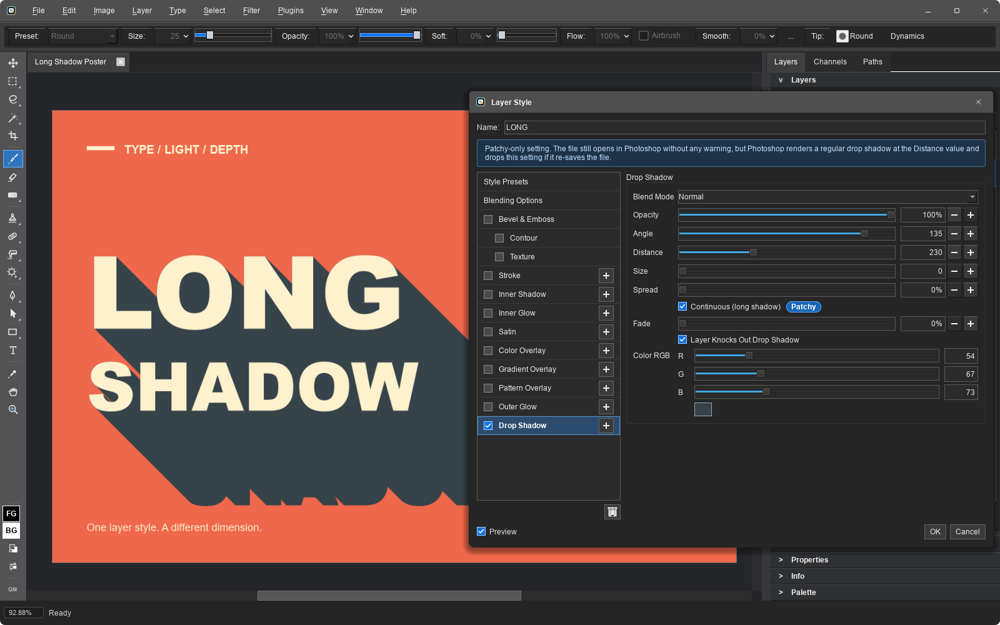</a> Layer styles with bevels, strokes, glows, overlays, and blending controls, shown here with continuous long shadows on editable type. This Patchy-specific extension opens in Photoshop as an ordinary drop shadow at the chosen distance; Photoshop may discard the extension when saving.</td>
<td align="center" valign="top" width="50%">
      
       Layer styles with multiple effects, blending controls, and Photoshop-compatible presets
    </td>
</tr>
<tr>
<td align="center" valign="top" width="50%">
      <a href="images/screenshots/brush_tips.png">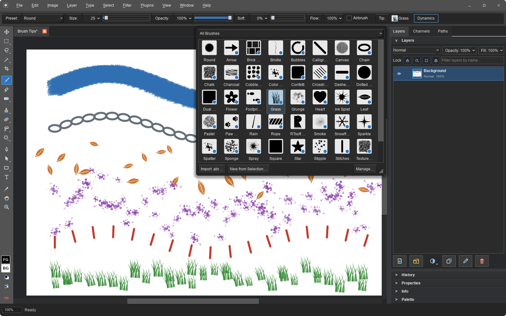</a>
       Brush presets, import and management; spacing, roundness and texture controls; pressure-aware size, opacity, flow, angle, scatter and color dynamics
    </td>
<td align="center" valign="top" width="50%">
      <a href="images/screenshots/palette_mode.png">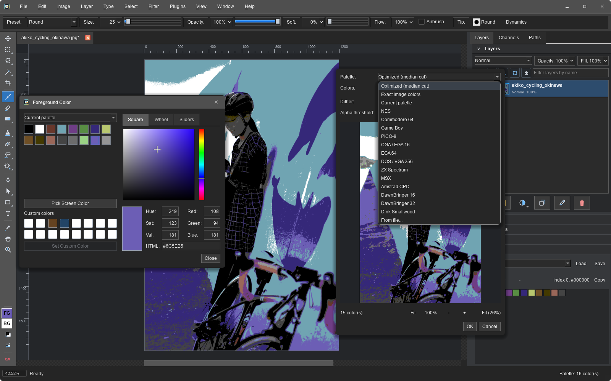</a>
       Palette mode constrains painting and editing to a document color set
    </td>
</tr>
<tr>
<td align="center" valign="top" width="50%">
      <a href="images/screenshots/image_trace.png">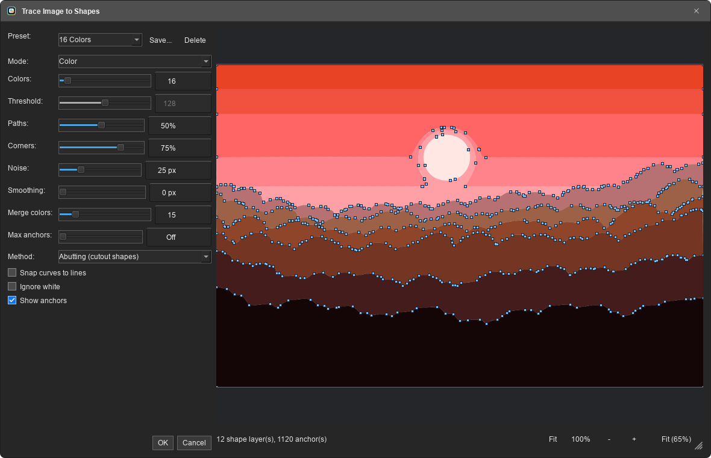</a>
       Trace Image to Shapes turns any image into editable vector shape layers, with Illustrator-style presets and a live traced preview
    </td>
<td align="center" valign="top" width="50%">
      
       Live Warp Text, rich paragraph styling, letter spacing, and Japanese vertical columns, kept as editable text layers
    </td>
</tr>
<tr>
<td align="center" valign="top" width="50%">
      <a href="images/screenshots/tile_preview.png">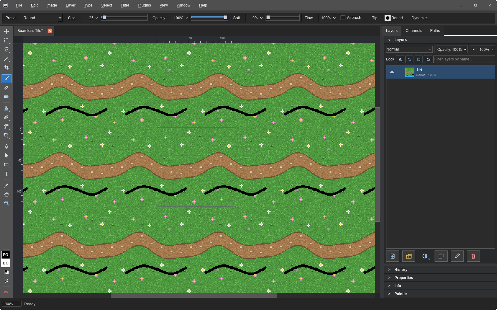</a>
       Seamless tiling mode for game textures: paint on the canvas and strokes wrap live across every tile
    </td>
<td align="center" valign="top" width="50%">
      
       Smart Objects: Warp Transform bends them non-destructively, Edit Contents opens the embedded file in its own tab
    </td>
</tr>
<tr>
<td align="center" valign="top" width="50%">
      <a href="images/screenshots/pattern_manager.png">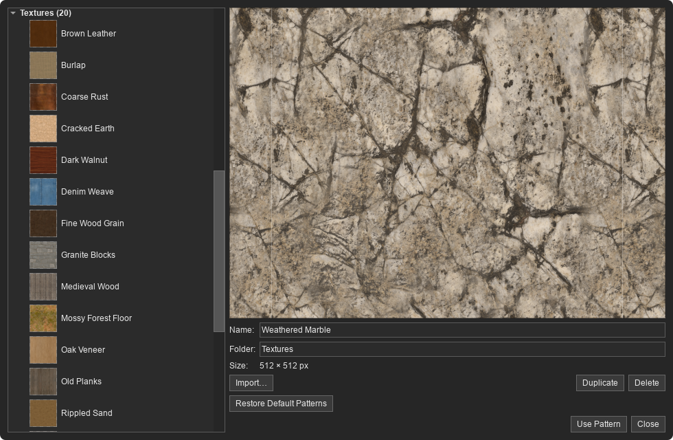</a>
       Photo textures in the Pattern Manager, with full-resolution preview, import, organization, and editing
    </td>
<td align="center" valign="top" width="50%">
      <a href="images/screenshots/camera_raw.png">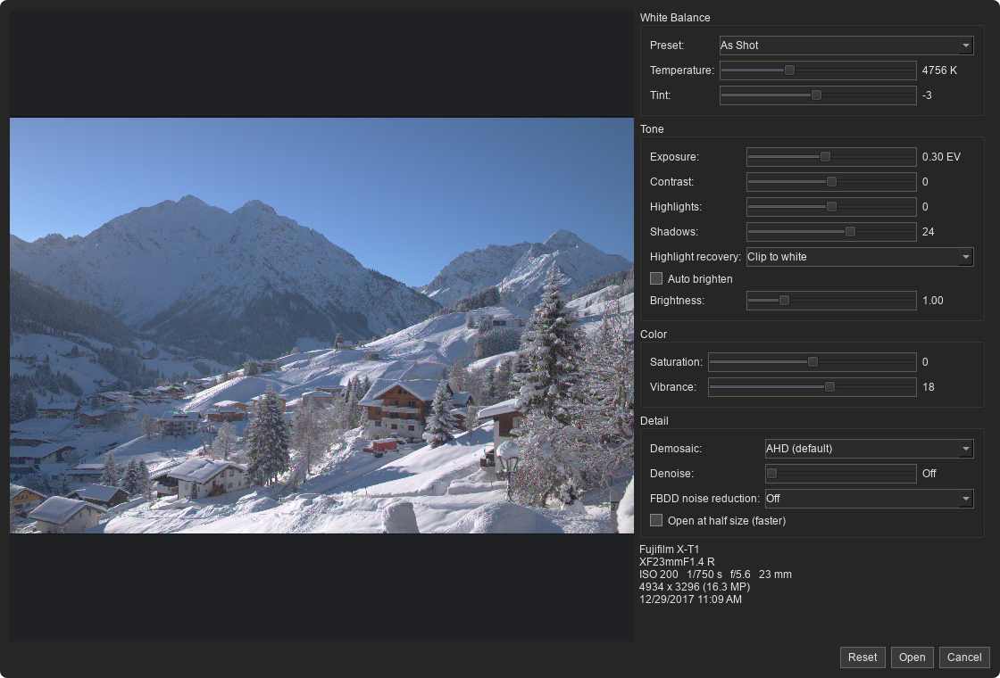</a>
       16-bit Camera Raw development with white balance, tone, color, demosaic, and denoise controls
    </td>
</tr>
<tr>
<td align="center" valign="top" width="50%">
      
       Tilt-Shift Blur with live on-image focus, angle, and transition controls
    </td>
<td align="center" valign="top" width="50%">
      <a href="images/screenshots/material_styles.png">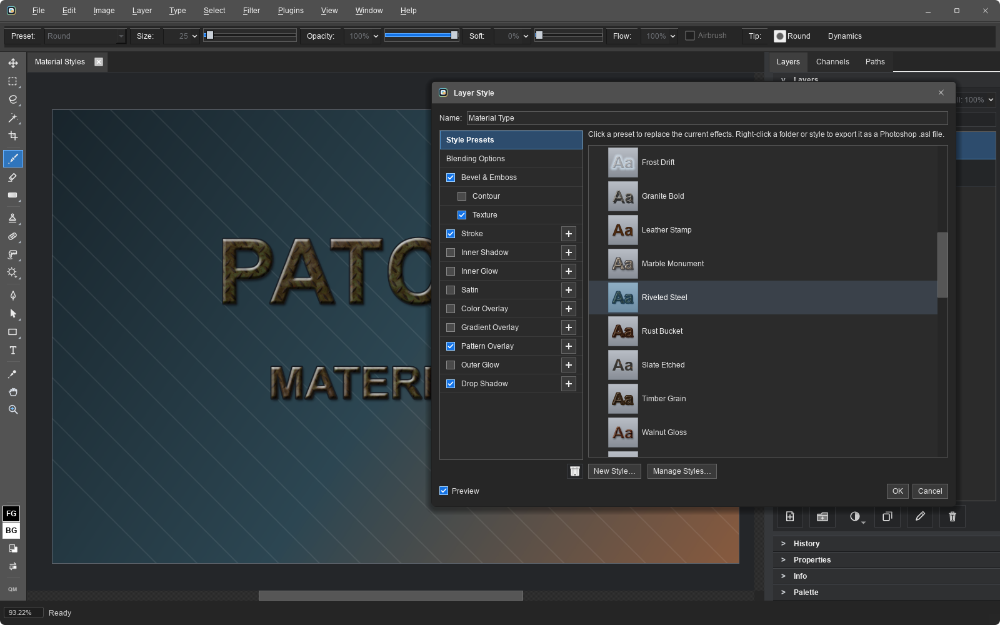</a>
       Material layer styles backed by bundled CC0 wood, stone, metal, fabric, and ground textures
    </td>
</tr>
<tr>
<td align="center" valign="top" width="50%">
      <a href="images/screenshots/quick_mask.png">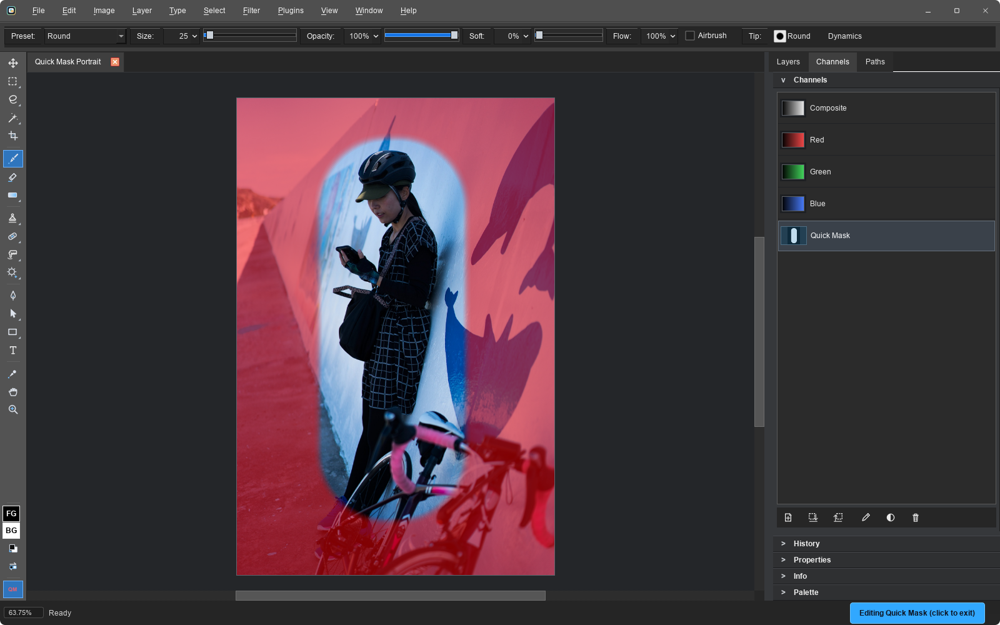</a>
       Quick Mask turns a selection into a brush-editable red overlay, then back into marching ants
    </td>
<td align="center" valign="top" width="50%">
      
       Vector shape layers, editable pen paths and anchors, gradient and pattern paint, dashed strokes, rounded corners, and the Paths panel
    </td>
</tr>
<tr>
<td align="center" valign="top" width="50%">
      <a href="images/screenshots/svg_import.png">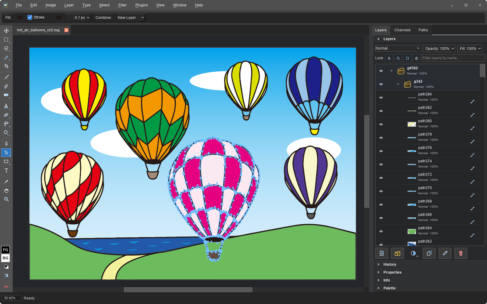</a>
       SVG files open as editable shape layers: groups become folders, paths stay live vectors
    </td>
<td align="center" valign="top" width="50%">
      <a href="images/screenshots/script_manager.png">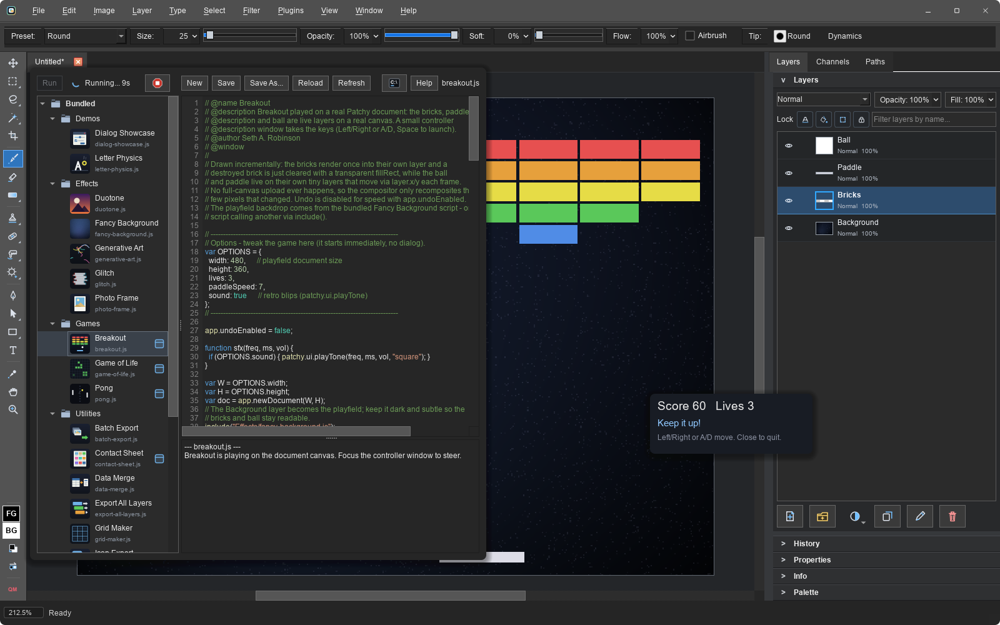</a>
       Script Manager running the bundled Breakout: the game plays on a real canvas, with live run status and one-click stop
    </td>
</tr>
<tr>
<td align="center" valign="top" colspan="2">
      <a href="images/screenshots/script_options.png">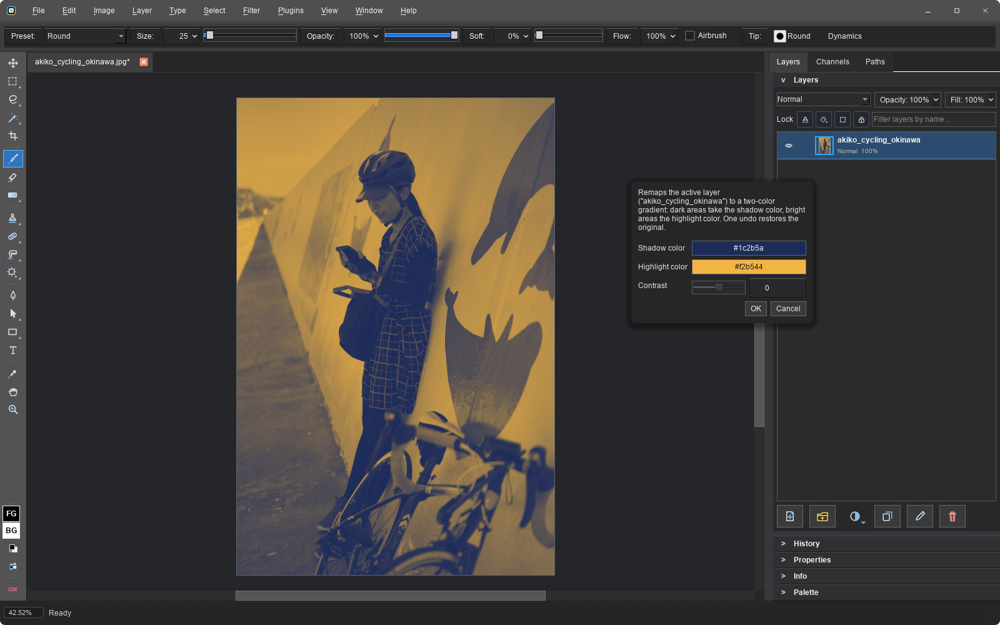</a>
       Scripts ask with real options dialogs; the same script runs unattended from the command line with the same defaults
    </td>
</tr>
</table>

## 
